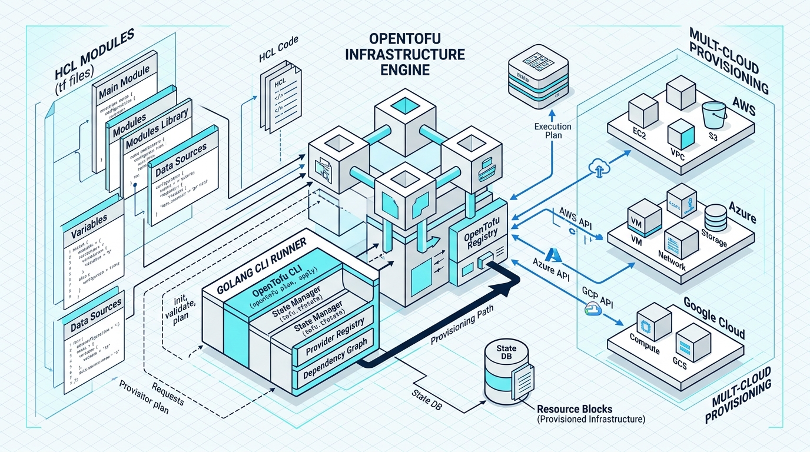
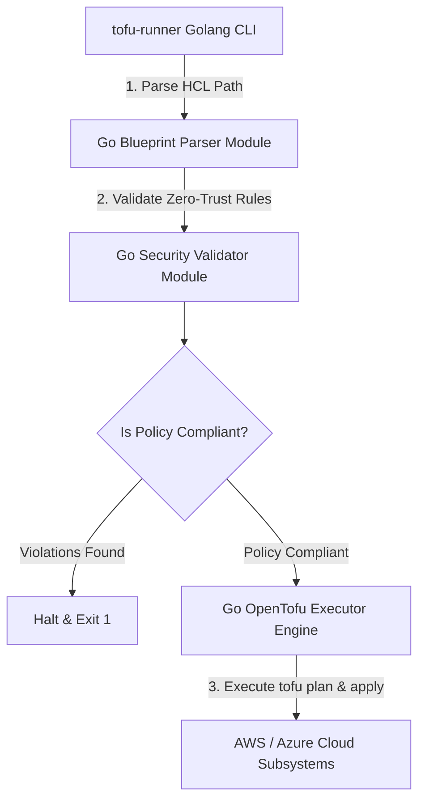

<div align="center">


# opentofu-blueprints

### OpenTofu HCL Blueprint Engine & Golang Infrastructure Orchestrator

[](https://devopstrio.co.uk)
[](https://go.dev)
[](https://opentofu.org)

</div>

---

## ⚡ Technical Overview & Pure Golang Architecture

The **OpenTofu Blueprints Engine** is a high-performance infrastructure orchestration platform written in **pure Golang (Go)** paired with **OpenTofu HCL** infrastructure modules.

It eliminates Python dependencies for cloud native automation, leveraging Go's native speed, strict typing, and concurrency to parse OpenTofu blueprints, validate zero-trust security baselines, and execute multi-cloud infrastructure plans.



---

## 🔄 Golang Execution Sequence Flow



---

## 📂 Repository Directory Layout

```
opentofu-blueprints/
├── .github/
│   └── workflows/
│       └── tofu-ci.yml          # GitHub Actions Go & OpenTofu CI pipeline
├── docs/
│   ├── ARCHITECTURE.md          # Architecture specification document
│   ├── deployment-guide.md      # Integration & deployment manual
│   └── images/
│       └── architecture_diagram.jpg # Visual blueprint diagram
├── go.mod                       # Go module manifest
├── go.sum                       # Go checksum lockfile
├── main.go                      # Go CLI binary entrypoint (tofu-runner)
├── pkg/
│   ├── blueprint/
│   │   ├── parser.go            # Go HCL blueprint parser
│   │   └── parser_test.go       # Native Go unit tests
│   ├── validator/
│   │   ├── validator.go         # Go security policy validator
│   │   └── validator_test.go    # Native Go unit tests
│   └── executor/
│       ├── executor.go          # Go OpenTofu execution engine
│       └── executor_test.go     # Native Go unit tests
├── blueprints/
│   ├── aws-kubernetes/
│   │   ├── main.tf              # AWS EKS VPC HCL blueprint
│   │   ├── variables.tf         # Input variables
│   │   └── outputs.tf           # Output variables
│   └── azure-landingzone/
│       ├── main.tf              # Azure VNet HCL blueprint
│       ├── variables.tf         # Input variables
│       └── outputs.tf           # Output variables
├── scripts/
│   ├── install-opentofu.sh      # OpenTofu installer script
│   └── verify-blueprints.sh     # OpenTofu HCL verification script
├── .gitignore                   # Git ignore file
└── README.md                    # Engine manual documentation
```

---

## 🚀 Quick Start Guide

### 1. Build Golang CLI Binary

```bash
# Clone repository
git clone https://github.com/Devopstrio/opentofu-blueprints.git
cd opentofu-blueprints

# Build Go binary
go build -o tofu-runner main.go
```

### 2. Run OpenTofu Blueprint Provisioner

```bash
./tofu-runner blueprints/aws-kubernetes
```

### 3. Run Native Go Test Suite

```bash
go test -v ./...
```

<div align="center">

<sub>&copy; 2026 Devopstrio &mdash; Engineering Uninterrupted Global Workforce Productivity.</sub>

</div>
