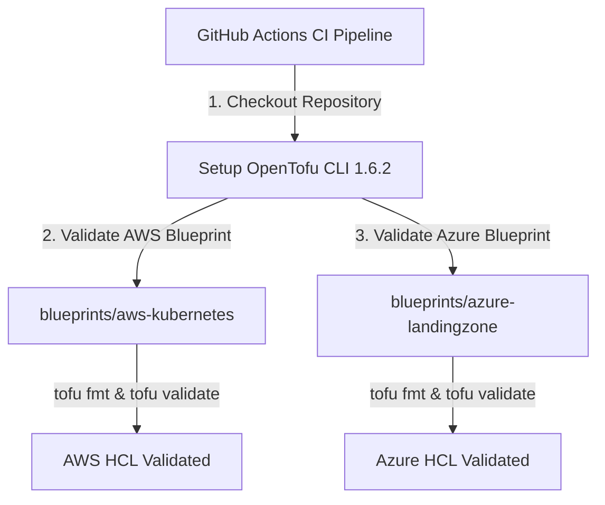

<div align="center">


# opentofu-blueprints

### Enterprise OpenTofu Infrastructure-as-Code (IaC) Blueprints

[](https://devopstrio.co.uk)
[](https://opentofu.org)
[](https://opentofu.org)

</div>

---

## ⚡ Technical Overview & OpenTofu Scope

The **OpenTofu Blueprints** repository provides production-ready Infrastructure-as-Code (IaC) blueprints targeting AWS and Azure cloud platforms using **OpenTofu HCL**.

It contains verified HCL modules for deploying multi-cloud virtual networks, subnets, and foundational infrastructure.


---

## 🔄 OpenTofu CI Validation Flow



---

## 📂 Repository Directory Layout

```
opentofu-blueprints/
├── .github/
│   └── workflows/
│       └── tofu-ci.yml          # GitHub Actions OpenTofu HCL CI pipeline
├── docs/
│   ├── ARCHITECTURE.md          # Architecture specification document
│   ├── deployment-guide.md      # Integration & deployment manual
│   └── images/
│       └── architecture_diagram.jpg # Visual blueprint diagram
├── blueprints/
│   ├── aws-kubernetes/
│   │   ├── main.tf              # AWS EKS VPC HCL blueprint
│   │   ├── variables.tf         # Input variables
│   │   └── outputs.tf           # Output variables
│   └── azure-landingzone/
│       ├── main.tf              # Azure VNet HCL blueprint
│       ├── variables.tf         # Input variables
│       └── outputs.tf           # Output variables
├── scripts/
│   ├── install-opentofu.sh      # OpenTofu installer script
│   └── verify-blueprints.sh     # OpenTofu HCL verification script
├── .gitignore                   # Git ignore file
└── README.md                    # Infrastructure manual documentation
```

---

## 🚀 Quick Start Guide

### 1. Deploy AWS Kubernetes Blueprint

```bash
cd blueprints/aws-kubernetes
tofu init
tofu plan
tofu apply -auto-approve
```

### 2. Deploy Azure Landing Zone Blueprint

```bash
cd blueprints/azure-landingzone
tofu init
tofu plan
tofu apply -auto-approve
```

<div align="center">

<sub>&copy; 2026 Devopstrio &mdash; Engineering Uninterrupted Global Workforce Productivity.</sub>

</div>
