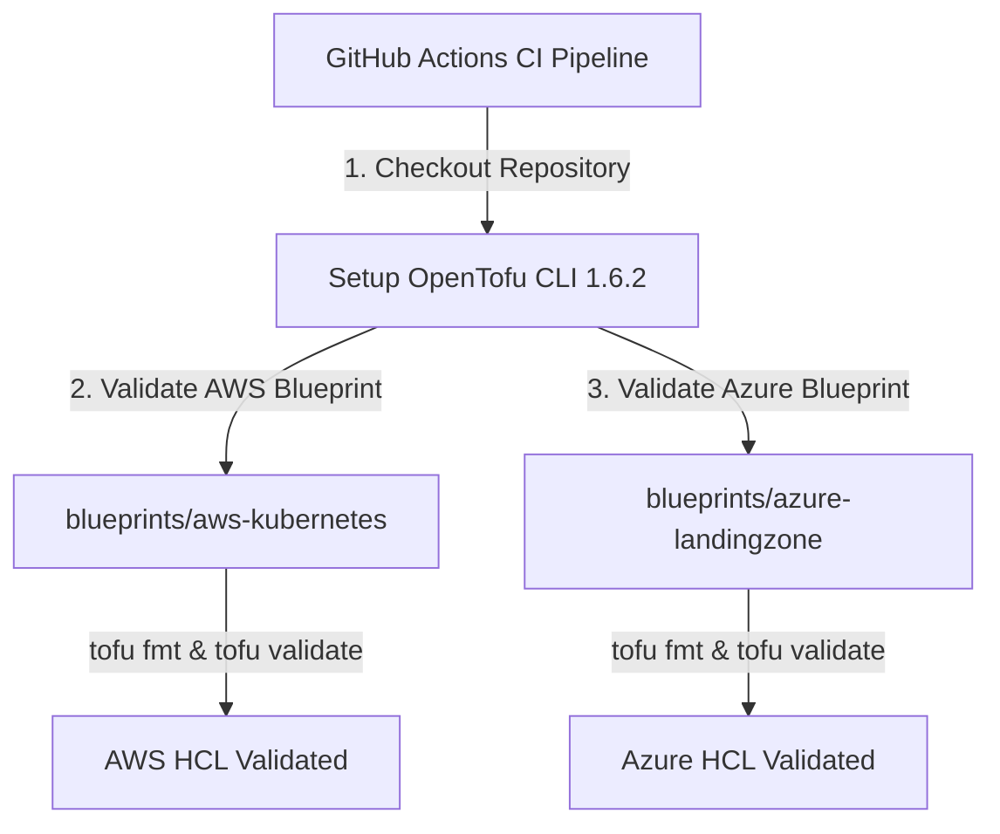

# OpenTofu Infrastructure Engine Architecture

The **OpenTofu Blueprints** repository contains production-ready Infrastructure-as-Code (IaC) blueprints targeting AWS and Azure cloud platforms using **OpenTofu HCL**.

## OpenTofu CI Validation Sequence

## Production OpenTofu Blueprints

1. **AWS Kubernetes Infrastructure Blueprint (`blueprints/aws-kubernetes`)**
   - High availability AWS VPC, subnets, and routing table configuration in HCL (`main.tf`, `variables.tf`, `outputs.tf`).

2. **Azure Landing Zone Infrastructure Blueprint (`blueprints/azure-landingzone`)**
   - Enterprise Azure Resource Group and Virtual Network configuration in HCL (`main.tf`, `variables.tf`, `outputs.tf`).
