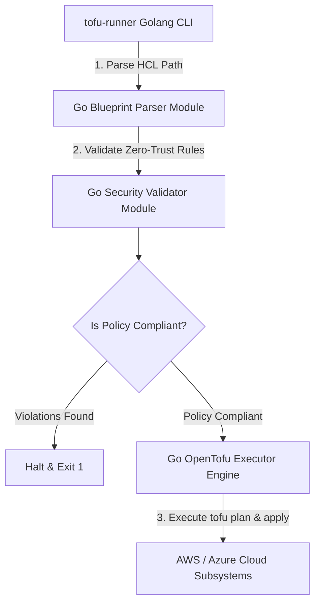

# OpenTofu Infrastructure Engine Architecture

The **OpenTofu Blueprints Engine** provides high-performance, open-source IaC orchestration using native **Golang** CLI runners and **OpenTofu HCL** infrastructure modules.

## Component Sequence Diagram

## Core Infrastructure & Golang Packages

1. **Golang Blueprint Parser (`pkg/blueprint/parser.go`)**
   - Parses OpenTofu HCL directories and metadata.

2. **Golang Security Validator (`pkg/validator/validator.go`)**
   - Evaluates zero-trust policy rules against blueprint resources.

3. **Golang OpenTofu Executor (`pkg/executor/executor.go`)**
   - Orchestrates OpenTofu binary execution (`tofu plan`, `tofu apply`).

4. **Native OpenTofu HCL Modules (`blueprints/`)**
   - Production HCL modules (`main.tf`, `variables.tf`, `outputs.tf`).
